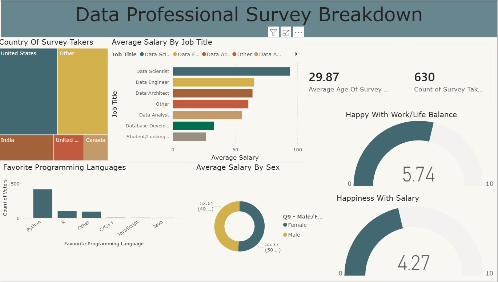

# PowerBI Projects 📊

Data analysis and visualization projects built with Microsoft Power BI.

## Projects

### 1. Data Proffesional Survey Breakdown

**Tools used:** Power BI, SQL, Excel

## Skills demonstrated
- Data cleaning and transformation
- DAX formulas
- Interactive dashboards
- SQL querying

## Connect
X: https://x.com/JavariaDaksh
